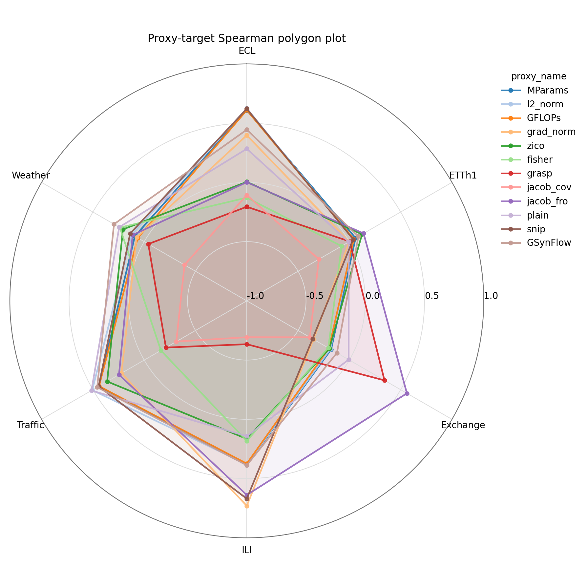

# Data-Conditioned Symbolic Zero-Cost Proxy Generation for Time-Series Neural Architecture Search: An Empirical Investigation

**Hyeoncheol Jung** · SeoulTech  
<br>*March 2026 – July 2026*

## Project Overview

### Motivation

Applying **Neural Architecture Search (NAS)** to time-series forecasting is computationally expensive because candidate architectures generally need to be trained and evaluated across different datasets and backbone families.

Zero-Cost Proxies (ZCPs) provide a potential alternative by estimating architecture quality without full training. However, our preliminary experiments showed that the ranking performance of existing ZCPs was highly inconsistent across different time-series datasets and backbone architectures.

<p align="center">
  
</p>

<p align="center">
  <em>
    Figure 1. Proxy-target Spearman correlations across six time-series datasets.
  </em>
</p>

If an effective proxy could be inferred directly from the characteristics of a target dataset, it could substantially reduce the computational cost required to identify suitable time-series architectures.

### Research Question

> **Can the statistical characteristics of a time-series dataset be used to infer a dataset-specific zero-cost proxy for neural architecture ranking?**

### Approach

We represented time-series datasets using **catch22 features**, which provide a compact statistical description of temporal characteristics.

Based on these dataset representations, we investigated whether a model could generate a **dataset-conditioned symbolic zero-cost proxy formula** composed of multiple existing ZCPs and mathematical operators.

The overall idea can be summarized as:

```text
Time-Series Dataset
        ↓
catch22 Feature Extraction
        ↓
Dataset Representation
        ↓
Data-Conditioned Symbolic Proxy Generator
        ↓
Zero-Cost Proxy Formula
        ↓
Architecture Ranking
```

### Outcome

The central hypothesis was **not supported empirically**.

Although several preliminary assumptions were supported — including the existence of dataset-dependent proxy performance and the potential benefit of combining multiple ZCPs — the statistical similarity between datasets did not reliably correspond to similarity in effective proxy behavior.

In particular:

* Time-series datasets with similar representations in the selected feature space did **not consistently share transferable high-performing proxies**.
* The learned relationship between dataset characteristics and optimal proxies did **not generalize reliably to unseen datasets**.
* Autoregressive symbolic formula generation introduced additional instability because small changes in generated tokens could result in substantially different proxy behavior.

As a result, we concluded that the central premise required for reliable **dataset-conditioned proxy generation** was not sufficiently supported and discontinued further development of this research direction.

---

# 1. Motivation

## 1.1 Computational Cost of Neural Architecture Search

Time-series forecasting problems can be addressed using a wide range of neural backbone architectures. However, identifying the most suitable architecture for a particular dataset typically requires training and evaluating many candidate models.

Given an architecture search space

$$
\mathcal{A} = \{a_1, a_2, \dots, a_N\},
$$

conventional architecture evaluation requires approximately

$$
a_i
\rightarrow
\text{Full Training}
\rightarrow
\text{Validation Performance}
$$

for every candidate architecture.

This process becomes computationally expensive when the search must be repeated across multiple time-series datasets.

This motivates the use of **Zero-Cost Proxies**, which aim to estimate architecture quality with little or no model training.

---

## 1.2 Limitations of Existing Zero-Cost Proxies

A central limitation observed during this project was that existing ZCPs did not exhibit consistently strong architecture-ranking performance across different time-series datasets.

A proxy that produced a high correlation with fully trained architecture performance on one dataset could perform substantially worse on another.

In other words,

$$
\rho(P, D_i)
\neq
\rho(P, D_j),
$$

where

* $P$ denotes a zero-cost proxy,
* $D_i$ and $D_j$ denote different time-series datasets, and
* $\rho$ denotes the Spearman rank correlation between proxy scores and fully trained model performance.

This observation suggested that a **single globally optimal proxy might not exist** for time-series architecture search.

Time-series datasets can also differ substantially in their statistical characteristics, including temporal dependency, periodicity, distributional structure, variability, and other dynamical properties.

This led to the possibility that the effectiveness of a ZCP might itself depend on the characteristics of the target dataset.

---

## 1.3 From Universal Proxies to Dataset-Specific Proxies

Instead of asking

> *Which zero-cost proxy performs best globally?*

we investigated a different question:

> *Which zero-cost proxy is most suitable for this particular dataset?*

Conceptually, the objective was to learn a mapping of the form

$$
F(D) \rightarrow P^*(D),
$$

where

* $D$ is a time-series dataset,
* $F(D)$ is a statistical representation of the dataset, and
* $P^*(D)$ is an effective zero-cost proxy for ranking architectures on that dataset.

If such a relationship could be learned, an unseen dataset could potentially be characterized using only a small number of time-series samples, after which an appropriate proxy could be inferred without performing an expensive architecture search.

### Research Question

> **Can we infer an effective zero-cost proxy for an unseen time-series dataset solely from its statistical characteristics?**

---

# 2. Hypotheses

The proposed framework was based on four main hypotheses.

## H1. Dataset-Specific Proxy Hypothesis

> **Different time-series datasets may have different optimal zero-cost proxies.**

Formally,

$$
P^*(D_i) \neq P^*(D_j)
$$

for at least some pairs of datasets $D_i$ and $D_j$.

Our preliminary proxy analysis provided empirical support for this hypothesis: the relative performance of individual ZCPs varied considerably across datasets.

**Project finding:** ✅ **Supported empirically**

---

## H2. Feature-Proxy Relationship Hypothesis

> **Time-series datasets with similar statistical characteristics should prefer similar zero-cost proxies.**

Let $F(D)$ represent the statistical feature representation of dataset $D$. The hypothesis assumes that

$$
\operatorname{Similarity}
\left(
F(D_i), F(D_j)
\right)
\uparrow
$$

should correspond to

$$
\operatorname{Similarity}
\left(
P^*(D_i), P^*(D_j)
\right)
\uparrow.
$$

This hypothesis is particularly important because it provides the foundation for transferring proxy knowledge between datasets.

If dataset similarity does not contain information about proxy behavior, learning a dataset-to-proxy mapping becomes substantially more difficult.

**Project finding:** ❌ **Not supported empirically**

---

## H3. Generalization Hypothesis

> **By learning dataset-to-proxy relationships across a sufficiently diverse collection of datasets, a model should be able to infer an effective proxy for an unseen dataset.**

Given training datasets

$$
\mathcal{D}_{train}
=
\{D_1, D_2, \dots, D_M\},
$$

the model attempts to learn

$$
F(D)
\rightarrow
P^*(D).
$$

For a previously unseen dataset $D_{test}$, the expected behavior would therefore be

$$
F(D_{test})
\rightarrow
\hat{P}(D_{test}),
$$

where $\hat{P}(D_{test})$ provides a strong ranking of candidate architectures.

This represents a form of **dataset-level generalization** rather than conventional sample-level generalization.

**Project finding:** ❌ **Not supported empirically**

---

## H4. Symbolic Compositionality Hypothesis

> **Combining multiple zero-cost proxies through symbolic mathematical expressions can produce stronger architecture-ranking signals than relying on a single ZCP.**

Instead of restricting the proxy space to

$$
P \in
\{
P_1, P_2, \dots, P_K
\},
$$

we considered symbolic compositions such as

$$
P =
g(P_1, P_2, \dots, P_K),
$$

where $g(\cdot)$ consists of mathematical operators such as addition, subtraction, multiplication, division, logarithms, square roots, and other transformations.

For example,

$$
P =
\frac{\text{Jacob}_{fro}}
{\text{SNIP}}
+
\text{GSynFlow}.
$$

Experiments with symbolic proxy search showed that combinations of multiple existing ZCPs could outperform individual proxies on some datasets.

**Project finding:** ✅ **Supported empirically**

---

## Summary of Hypotheses

| Hypothesis | Description                                                              | Outcome         |
| ---------- | ------------------------------------------------------------------------ | --------------- |
| **H1**     | Different datasets can have different optimal proxies                    | ✅ Supported     |
| **H2**     | Statistically similar datasets prefer similar proxies                    | ❌ Not supported |
| **H3**     | Dataset-to-proxy relationships generalize to unseen datasets             | ❌ Not supported |
| **H4**     | Symbolic combinations of multiple ZCPs can outperform individual proxies | ✅ Supported     |

The failure of **H2** was particularly important because it weakened the fundamental assumption required for **H3**.

Although dataset-specific proxy optimization itself was feasible, the experiments did not demonstrate a sufficiently stable relationship between the selected statistical dataset representation and effective proxy behavior.

---

# 3. Related Works

This project is related to four main research areas.

## 3.1 Neural Architecture Search for Time-Series Forecasting

Neural Architecture Search aims to automatically identify high-performing architectures from a predefined search space.

For time-series forecasting, the architecture search problem is particularly challenging because candidate models can differ in several structural dimensions, including:

* number of layers,
* hidden dimensions,
* attention mechanisms,
* temporal modeling components,
* feed-forward dimensions,
* and other backbone-specific architectural parameters.

Evaluating every architecture through full training is computationally expensive, motivating more efficient architecture evaluation strategies.

This project focuses specifically on reducing the **architecture evaluation cost** rather than modifying the architecture search algorithm itself.

---

## 3.2 Zero-Cost Proxies

Zero-Cost Proxies estimate the quality of an untrained or minimally initialized neural network using inexpensive statistics obtained from its parameters, gradients, activations, or computational structure.

The project considered multiple existing ZCPs, including:

* Fisher
* GFLOPs
* GSynFlow
* GraSP
* Grad Norm
* Jacobian Frobenius Norm
* Jacov
* L2-Norm
* Model Parameters
* SNIP
* ZiCo

Rather than assuming that one of these proxies is universally optimal, this project investigated whether their relative usefulness depends on the target time-series dataset.

The project further extended the conventional ZCP setting by considering **symbolic combinations of multiple proxies**.

---

## 3.3 catch22 Time-Series Features

To condition proxy generation on dataset characteristics, we required a compact representation of each time-series dataset.

For this purpose, we adopted **catch22**, a collection of 22 canonical time-series characteristics designed to summarize diverse temporal and statistical properties.

Instead of directly processing complete raw time-series datasets, catch22 features were extracted from sampled time-series instances and aggregated to construct a dataset-level representation.

Conceptually,

$$
D
\rightarrow
\text{catch22}
\rightarrow
F(D).
$$

This representation was subsequently used as the conditioning information for dataset-specific symbolic proxy generation.

One of the central questions investigated in this project was whether similarity in this feature space corresponded to similarity in effective zero-cost proxy behavior.

---

## 3.4 Meta-Learning and Dataset-Aware Neural Architecture Search

The proposed framework also shares motivation with **meta-learning** and **dataset-aware NAS**.

Instead of independently solving an architecture evaluation problem for every new dataset, meta-learning approaches attempt to exploit experience accumulated across previously observed tasks or datasets.

The conceptual objective of this project was similar:

$$
\{
D_1 \rightarrow P^*_1,
D_2 \rightarrow P^*_2,
\dots,
D_N \rightarrow P^*_N
\}
$$

was used to learn a higher-level relationship

$$
F(D)
\rightarrow
P^*(D).
$$

However, rather than directly predicting architecture performance or selecting an architecture, the proposed approach attempted to generate an **evaluation function itself** — a symbolic zero-cost proxy conditioned on the target dataset.

This distinction formed the main conceptual difference between the proposed framework and conventional architecture-performance predictors.
